# Flow Diagram - Medical Record Management System

```mermaid
flowchart TD
    Start([Start]) --> Login{User Login}
    Login -->|Invalid| Login
    Login -->|Valid| RoleCheck{Check User Role}
    
    RoleCheck -->|Admin| AdminFlow[Admin Dashboard]
    RoleCheck -->|Doctor| DoctorFlow[Doctor Dashboard]
    RoleCheck -->|Nurse| NurseFlow[Nurse Dashboard]
    RoleCheck -->|Patient| PatientFlow[Patient Portal]
    RoleCheck -->|Receptionist| ReceptionistFlow[Receptionist Dashboard]
    RoleCheck -->|Lab Tech| LabFlow[Lab Dashboard]
    RoleCheck -->|Civil Authority| CivilFlow[Civil Authority Dashboard]

    %% Admin Flow
    AdminFlow --> AdminTasks{Admin Tasks}
    AdminTasks -->|User Management| UserMgmt[Manage Users]
    AdminTasks -->|System Monitoring| SystemMonitor[Monitor System]
    AdminTasks -->|Analytics| Analytics[View Analytics]
    AdminTasks -->|Permissions| Permissions[Manage Permissions]

    %% Doctor Flow
    DoctorFlow --> DoctorTasks{Doctor Tasks}
    DoctorTasks -->|Patient Records| ViewPatients[View Patient Records]
    DoctorTasks -->|Appointments| ManageAppointments[Manage Appointments]
    DoctorTasks -->|Medical Records| CreateRecords[Create Medical Records]
    DoctorTasks -->|Prescriptions| CreatePrescriptions[Create Prescriptions]
    DoctorTasks -->|Hospitalisations| ManageHospitalisations[Manage Hospitalisations]
    DoctorTasks -->|Telemedicine| Telemedicine[Telemedicine Consultations]

    %% Nurse Flow
    NurseFlow --> NurseTasks{Nurse Tasks}
    NurseTasks -->|Patient Care| PatientCare[Patient Care Plans]
    NurseTasks -->|Assigned Patients| AssignedPatients[View Assigned Patients]
    NurseTasks -->|Hospitalisations| NurseHospitalisations[Monitor Hospitalisations]

    %% Patient Flow
    PatientFlow --> PatientTasks{Patient Tasks}
    PatientTasks -->|My Records| MyRecords[View My Records]
    PatientTasks -->|Appointments| MyAppointments[View Appointments]
    PatientTasks -->|Prescriptions| MyPrescriptions[View Prescriptions]
    PatientTasks -->|Health Tracking| HealthTracking[Health Tracking]

    %% Receptionist Flow
    ReceptionistFlow --> ReceptionistTasks{Receptionist Tasks}
    ReceptionistTasks -->|Patient Registration| RegisterPatient[Register New Patient]
    ReceptionistTasks -->|Check-in| CheckIn[Patient Check-in]
    ReceptionistTasks -->|Insurance| Insurance[Insurance Management]
    ReceptionistTasks -->|Billing| Billing[Manage Billing]

    %% Lab Tech Flow
    LabFlow --> LabTasks{Lab Technician Tasks}
    LabTasks -->|Lab Results| LabResults[Manage Lab Results]
    LabTasks -->|Quality Assurance| QualityAssurance[Quality Assurance]
    LabTasks -->|Inventory| Inventory[Manage Inventory]

    %% Civil Authority Flow
    CivilFlow --> CivilTasks{Civil Authority Tasks}
    CivilTasks -->|Birth Certificates| BirthCert[Process Birth Certificates]
    CivilTasks -->|Death Certificates| DeathCert[Process Death Certificates]

    %% Common Processes
    ViewPatients --> SelectPatient{Select Patient}
    SelectPatient --> PatientDetails[Patient Details]
    PatientDetails --> MedicalHistory[Medical History]
    MedicalHistory --> CreateRecords
    CreateRecords --> SaveRecord{Save Record?}
    SaveRecord -->|Yes| RecordSaved[Record Saved]
    SaveRecord -->|No| PatientDetails

    ManageAppointments --> ScheduleAppointment[Schedule Appointment]
    ScheduleAppointment --> AppointmentSaved[Appointment Saved]

    CreatePrescriptions --> PrescriptionForm[Prescription Form]
    PrescriptionForm --> PrescriptionSaved[Prescription Saved]

    RegisterPatient --> PatientForm[Patient Registration Form]
    PatientForm --> PatientSaved[Patient Saved]

    %% End Points
    RecordSaved --> Logout[Logout]
    AppointmentSaved --> Logout
    PrescriptionSaved --> Logout
    PatientSaved --> Logout
    UserMgmt --> Logout
    SystemMonitor --> Logout
    Analytics --> Logout
    Permissions --> Logout
    PatientCare --> Logout
    AssignedPatients --> Logout
    NurseHospitalisations --> Logout
    MyRecords --> Logout
    MyAppointments --> Logout
    MyPrescriptions --> Logout
    HealthTracking --> Logout
    CheckIn --> Logout
    Insurance --> Logout
    Billing --> Logout
    LabResults --> Logout
    QualityAssurance --> Logout
    Inventory --> Logout
    BirthCert --> Logout
    DeathCert --> Logout

    Logout --> End([End])
```

## Process Flows:

### **1. User Authentication Flow**
- Login validation
- Role-based access
- Session management

### **2. Patient Management Flow**
- Registration → Records → History
- Appointment scheduling
- Medical record creation

### **3. Clinical Workflow**
- Patient consultation
- Record creation
- Prescription management
- Follow-up scheduling

### **4. Administrative Flow**
- User management
- System monitoring
- Reporting and analytics

### **5. Lab Workflow**
- Sample processing
- Result management
- Quality assurance

### **6. Civil Authority Flow**
- Certificate processing
- Document verification
- Legal compliance 