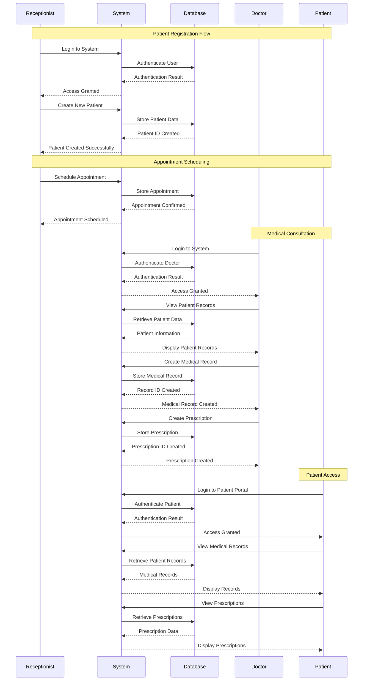

# Sequence Diagram - Patient Registration and Medical Record Creation

## Key Interactions:

### 1. **Patient Registration**
- Receptionist creates patient account
- System validates and stores data
- Patient ID generated

### 2. **Appointment Scheduling**
- Receptionist schedules appointments
- System manages availability
- Notifications sent

### 3. **Medical Consultation**
- Doctor accesses patient records
- Creates medical records
- Issues prescriptions

### 4. **Patient Access**
- Patient views their records
- Accesses prescriptions
- Downloads documents 