# System Architecture - Medical Record Management System

## Architecture Overview

### **Frontend Layer**
- **Web Application** (Next.js)
- **Patient Portal**
- **Admin Dashboard**
- **Mobile Interface**

### **API Layer**
- **Authentication API**
- **Patient Management API**
- **Medical Records API**
- **Appointment API**
- **Laboratory API**
- **Billing API**

### **Database Layer**
- **MySQL Database** (Primary)
- **Redis Cache**
- **File Storage** (AWS S3)

### **Security Layer**
- **JWT Authentication**
- **Role-Based Access Control**
- **Data Encryption**
- **Audit Logging**

### **External Services**
- **Email Service**
- **SMS Notifications**
- **Payment Processing**
- **Telemedicine Integration**

## Technology Stack

### **Frontend**
- Next.js 15
- React
- TypeScript
- Tailwind CSS
- Shadcn/ui Components

### **Backend**
- Next.js API Routes
- MySQL Database
- Redis Caching
- JWT Authentication

### **Infrastructure**
- AWS Cloud
- Vercel Deployment
- Database Hosting
- File Storage

### **Security**
- HTTPS/SSL
- Data Encryption
- MFA Support
- Audit Trails

## Data Flow

1. **User Authentication** → JWT Token
2. **API Requests** → Role Validation
3. **Database Operations** → Encrypted Storage
4. **File Uploads** → Secure Cloud Storage
5. **Notifications** → External Services

## Scalability Features

- **Load Balancing**
- **Database Replication**
- **Caching Strategy**
- **CDN Integration**
- **Auto-scaling**

```mermaid
graph TB
    %% External Users
    subgraph "External Users"
        Doctor[👨‍⚕️ Doctor]
        Nurse[👩‍⚕️ Nurse]
        Patient[👤 Patient]
        Receptionist[👥 Receptionist]
        LabTech[🧪 Lab Technician]
        Admin[👨‍💼 Admin]
        CivilAuth[🏛️ Civil Authority]
    end

    %% Frontend Layer
    subgraph "Frontend Layer"
        WebApp[🌐 Web Application]
        MobileApp[📱 Mobile Application]
        PatientPortal[🏥 Patient Portal]
        AdminPanel[⚙️ Admin Panel]
    end

    %% API Gateway & Security
    subgraph "API Gateway & Security"
        APIGateway[🚪 API Gateway]
        LoadBalancer[⚖️ Load Balancer]
        WAF[🛡️ Web Application Firewall]
        MFA[🔒 Multi-Factor Authentication]
        SSO[🔐 Single Sign-On]
    end

    %% Application Layer
    subgraph "Application Layer"
        AuthService[🔐 Authentication Service]
        UserService[👥 User Management Service]
        PatientService[🏥 Patient Service]
        MedicalService[📋 Medical Records Service]
        AppointmentService[📅 Appointment Service]
        LabService[🧪 Laboratory Service]
        BillingService[💰 Billing Service]
        NotificationService[🔔 Notification Service]
        AnalyticsService[📊 Analytics Service]
    end

    %% Data Layer
    subgraph "Data Layer"
        PrimaryDB[(🗄️ Primary Database<br/>MySQL)]
        ReadReplica[(📖 Read Replica<br/>MySQL)]
        Cache[(⚡ Redis Cache)]
        FileStorage[(📁 File Storage<br/>AWS S3)]
        BackupDB[(💾 Backup Database<br/>MySQL)]
    end

    %% External Services
    subgraph "External Services"
        EmailService[📧 Email Service<br/>AWS SES]
        SMSService[📱 SMS Service<br/>AWS SNS]
        PaymentGateway[💳 Payment Gateway<br/>Stripe]
        InsuranceAPI[🏦 Insurance API]
        TelemedicineAPI[📹 Telemedicine API]
    end

    %% Monitoring & Security
    subgraph "Monitoring & Security"
        CloudWatch[📊 CloudWatch Monitoring]
        CloudTrail[🛤️ CloudTrail Logging]
        SecurityHub[🔒 Security Hub]
        BackupService[💾 Backup Service]
        DisasterRecovery[🔄 Disaster Recovery]
    end

    %% Cloud Infrastructure
    subgraph "AWS Cloud Infrastructure"
        VPC[🌐 Virtual Private Cloud]
        Subnet1[📡 Public Subnet]
        Subnet2[🏠 Private Subnet]
        Subnet3[🏠 Private Subnet]
        InternetGateway[🌍 Internet Gateway]
        NATGateway[🌐 NAT Gateway]
    end

    %% Connections
    Doctor --> WebApp
    Nurse --> WebApp
    Patient --> PatientPortal
    Receptionist --> WebApp
    LabTech --> WebApp
    Admin --> AdminPanel
    CivilAuth --> WebApp

    WebApp --> APIGateway
    MobileApp --> APIGateway
    PatientPortal --> APIGateway
    AdminPanel --> APIGateway

    APIGateway --> LoadBalancer
    LoadBalancer --> WAF
    WAF --> MFA
    MFA --> SSO

    SSO --> AuthService
    AuthService --> UserService
    UserService --> PatientService
    PatientService --> MedicalService
    MedicalService --> AppointmentService
    AppointmentService --> LabService
    LabService --> BillingService
    BillingService --> NotificationService
    NotificationService --> AnalyticsService

    AuthService --> PrimaryDB
    UserService --> PrimaryDB
    PatientService --> PrimaryDB
    MedicalService --> PrimaryDB
    AppointmentService --> PrimaryDB
    LabService --> PrimaryDB
    BillingService --> PrimaryDB
    NotificationService --> PrimaryDB
    AnalyticsService --> ReadReplica

    MedicalService --> FileStorage
    LabService --> FileStorage
    NotificationService --> EmailService
    NotificationService --> SMSService
    BillingService --> PaymentGateway
    BillingService --> InsuranceAPI
    AppointmentService --> TelemedicineAPI

    PrimaryDB --> BackupDB
    FileStorage --> BackupService
    CloudWatch --> SecurityHub
    CloudTrail --> SecurityHub

    %% Infrastructure
    WebApp --> VPC
    MobileApp --> VPC
    PatientPortal --> VPC
    AdminPanel --> VPC
    VPC --> Subnet1
    VPC --> Subnet2
    VPC --> Subnet3
    Subnet1 --> InternetGateway
    Subnet2 --> NATGateway
    Subnet3 --> NATGateway
```

## Architecture Components:

### **1. Frontend Layer**
- **Web Application**: Main interface for healthcare providers
- **Mobile Application**: Mobile access for doctors and nurses
- **Patient Portal**: Dedicated patient interface
- **Admin Panel**: System administration interface

### **2. API Gateway & Security**
- **API Gateway**: Centralized API management
- **Load Balancer**: Traffic distribution
- **Web Application Firewall**: Security protection
- **Multi-Factor Authentication**: Enhanced security
- **Single Sign-On**: Unified authentication

### **3. Application Services**
- **Authentication Service**: User authentication and authorization
- **User Management Service**: User profile and role management
- **Patient Service**: Patient data management
- **Medical Records Service**: Medical documentation
- **Appointment Service**: Scheduling and consultations
- **Laboratory Service**: Lab results and testing
- **Billing Service**: Financial management
- **Notification Service**: Communication system
- **Analytics Service**: Reporting and insights

### **4. Data Layer**
- **Primary Database**: Main data storage (MySQL)
- **Read Replica**: Performance optimization
- **Redis Cache**: Session and data caching
- **File Storage**: Document and image storage (AWS S3)
- **Backup Database**: Data protection

### **5. External Services**
- **Email Service**: Patient communications
- **SMS Service**: Appointment reminders
- **Payment Gateway**: Financial transactions
- **Insurance API**: Insurance verification
- **Telemedicine API**: Virtual consultations

### **6. Security & Monitoring**
- **CloudWatch**: System monitoring
- **CloudTrail**: Audit logging
- **Security Hub**: Security management
- **Backup Service**: Data protection
- **Disaster Recovery**: Business continuity

### **7. Cloud Infrastructure**
- **Virtual Private Cloud**: Network isolation
- **Public/Private Subnets**: Network segmentation
- **Internet Gateway**: External connectivity
- **NAT Gateway**: Private resource access

## Security Features:
- **Data Encryption**: At rest and in transit
- **Role-Based Access Control**: Granular permissions
- **Audit Logging**: Complete activity tracking
- **Compliance**: HIPAA, GDPR compliance
- **Backup & Recovery**: Data protection 